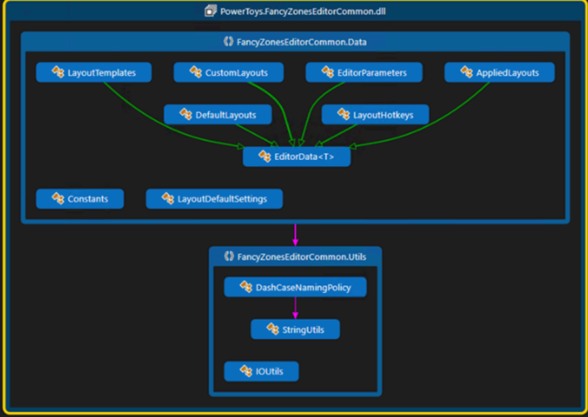

# FancyZones

## Quick Links

[All Issues](https://github.com/microsoft/PowerToys/issues?q=is%3Aopen%20label%3AProduct-FancyZones) 
[Bugs](https://github.com/microsoft/PowerToys/issues?q=is%3Aopen%20label%3AProduct-FancyZones%20label%3AIssue-Bug%20) 
[Pull Requests](https://github.com/microsoft/PowerToys/pulls?q=is%3Apr+FancyZone)

## Overview

FancyZones is a window manager utility that allows users to create custom layouts for organizing windows on their screen.

## Architecture Overview

FancyZones consists of several interconnected components:

### Interface Layer: FancyZonesModuleInterface
- Exposes interface between FancyZones and the Runner
- Handles communication and configuration exchange
- Contains minimal code, most logic implemented in other modules

### UI Layer: FancyZonesEditor and FancyZonesEditorCommon
- **FancyZonesEditor**: Main UI implementation with MainWindow.xaml as entry point
- **FancyZonesEditorCommon**: Provides data structures and I/O helpers for the Editor
- Acts as a visual config editor for layout configuration

### Backend Implementation: FancyZones and FancyZonesLib
- **FancyZonesLib**: Core logic implementation
  - All drag-and-drop behavior
  - Layout UI during dragging (generated in C++ via WorkArea.cpp, NewZonesOverlayWindow function)
  - Core data structures
- **FancyZones**: Wrapper around FancyZonesLib

## Configuration Management

### Configuration Files Location
- Path: `C:\Users\[username]\AppData\Local\Microsoft\PowerToys\FancyZones`
- Files:
  - EditorParameters
  - AppliedLayouts
  - CustomLayouts
  - DefaultLayouts
  - LayoutHotkeys
  - LayoutTemplates
  - AppZoneHistory

### Configuration Handling
- No central configuration handler
- Editor: Read/write handlers in FancyZonesEditorCommon project
- FancyZones: Read/write handlers in FancyZonesLib project
- Data synchronization: Editor sends update events, FancyZones refreshes memory data

## Window Management

### Monitor Detection and DPI Scaling
- Monitor detection handled in `FancyZones::MoveSizeUpdate` function
- DPI scaling: FancyZones retrieves window position without needing mouse DPI scaling info
- Window scaling uses system interface via `WindowMouseSnap::MoveSizeEnd()` function

### Zone Tracking
- Window-to-zone tracking implemented in `FancyZones::MoveSizeUpdate` function
- Maintains history of which windows belong to which zones

## Development History

- FancyZones was originally developed as a proof of concept
- Many configuration options were added based on community feedback after initial development
- Some options were added to address specific issues:
  - Options for child windows or pop-up windows
  - Some options were removed later
  - Community feedback led to more interactions being implemented
## Admin Mode Considerations

- FancyZones can't move admin windows unless running as admin
- By default, all utilities run as admin if PowerToys is running as admin

## Troubleshooting

### First Run JSON Error
**Error**: "The input does not contain any JSON tokens. Expected the input to start with a valid JSON token, when isFinalBlock is true. Path: $ | LineNumber: 0 | BytePositionInLine: 0."

**Solution**: Launch the FancyZones Editor once through PowerToys Settings UI. Running the Editor directly within the project will not initialize the required configuration files.

### Known Issues
- Potential undiscovered bugs related to data updates in the Editor
- Some automated tests pass in CI but fail on specific machines
- Complex testing requirements across different monitor configurations

## FancyZones UI Testing

UI tests are implemented using [Windows Application Driver](https://github.com/microsoft/WinAppDriver).

### Before running tests

  - Install Windows Application Driver v1.2.1 from https://github.com/microsoft/WinAppDriver/releases/tag/v1.2.1. 
  - Enable Developer Mode in Windows settings

### Running tests
  
  - Exit PowerToys if it's running
  - Run WinAppDriver.exe from the installation directory. Skip this step if installed in the default directory (`C:\Program Files (x86)\Windows Application Driver`); in this case, it'll be launched automatically during tests.
  - Open `PowerToys.sln` in Visual Studio and build the solution.
  - Run tests in the Test Explorer (`Test > Test Explorer` or `Ctrl+E, T`). 

>Note: notifications or other application windows, that are shown above the window under test, can disrupt the testing process.

### Test Framework Structure

#### UI Test Requirements
All test cases require pre-configured user data and must reset this data before each test.

**Required User Data Files**:
- EditorParameters
- AppliedLayouts
- CustomLayouts
- DefaultLayouts
- LayoutHotkeys
- LayoutTemplates
- AppZoneHistory

#### Editor Test Suite

**ApplyLayoutTest.cs**
- Verifies layout application and selection per monitor
- Tests file updates and behavior under display switching
- Validates virtual desktop changes

**CopyLayoutTests.cs**
- Tests copying various layout types
- Validates UI and file correctness

**CreateLayoutTests.cs**
- Tests layout creation and cancellation
- Focuses on file correctness validation

**CustomLayoutsTests.cs**
- Tests user-created layout operations
- Covers renaming, highlight line changes, zone count changes

**DefaultLayoutsTest.cs**
- Validates default and user layout files

**DeleteLayoutTests.cs**
- Tests layout deletion across types
- Checks both UI and file updates

**EditLayoutTests.cs**
- Tests zone operations: add/delete/move/reset/split/merge

**FirstLaunchTest.cs**
- Verifies Editor launches correctly on first run

**LayoutHotkeysTests.cs**
- Tests hotkey configuration file correctness
- Note: Actual hotkey behavior tested in FancyZones backend

**TemplateLayoutsTests.cs**
- Tests operations on built-in layouts
- Covers renaming, highlight changes, zone count changes

#### FancyZones Backend Tests

**LayoutApplyHotKeyTests.cs**
- Focuses on hotkey-related functionality
- Tests actual hotkey behavior implementation

### Extra tools and information

**Test samples**: https://github.com/microsoft/WinAppDriver/tree/master/Samples

While working on tests, you may need a tool that helps you to view the element's accessibility data, e.g. for finding the button to click. For this purpose, you could use [AccessibilityInsights](https://accessibilityinsights.io/docs/windows/overview) or [WinAppDriver UI Recorder](https://github.com/microsoft/WinAppDriver/wiki/WinAppDriver-UI-Recorder).

>Note: close helper tools while running tests. Overlapping windows can affect test results.

