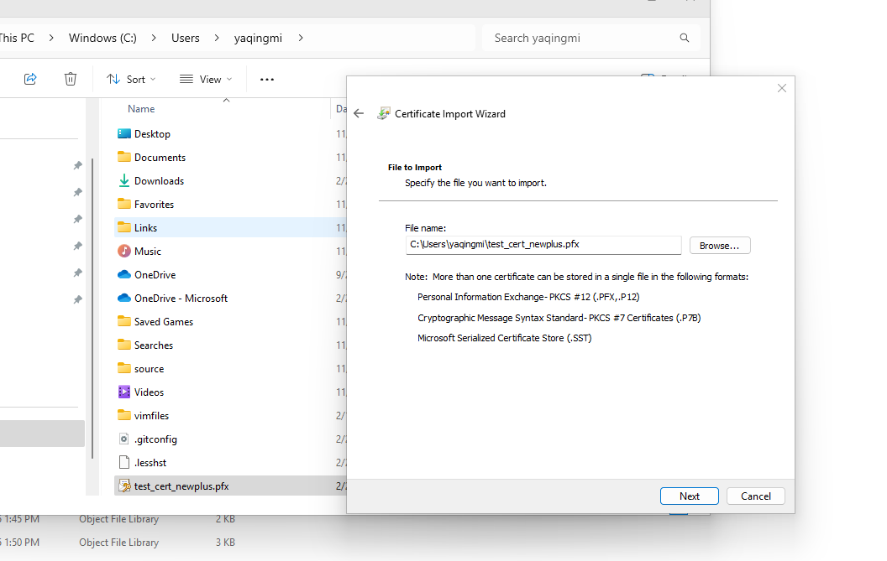
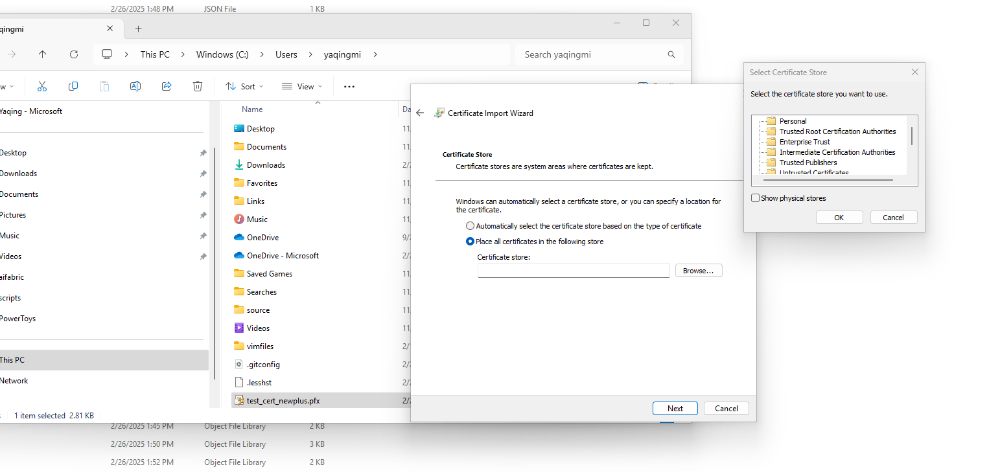
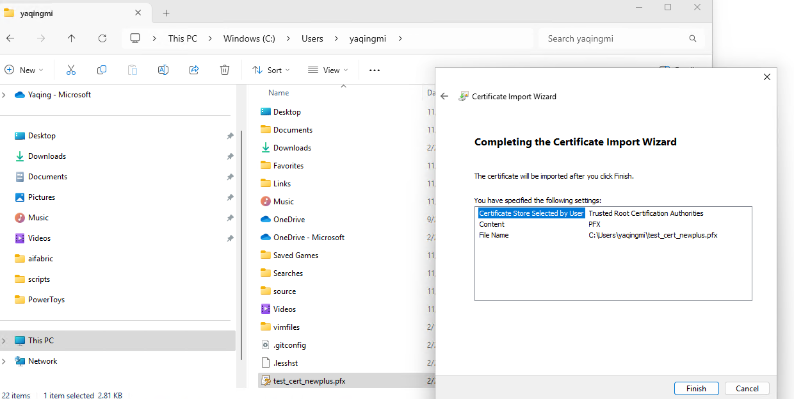
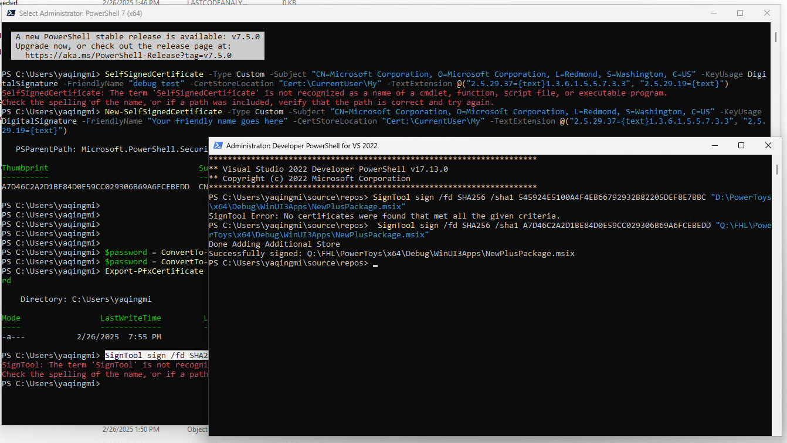

# NewPlus Module

## Overview

NewPlus is a PowerToys module that provides a context menu entry for creating new files directly from File Explorer. Unlike some other modules, NewPlus implements a different approach to context menu registration to avoid duplication issues in Windows 11.

## Context Menu Implementation

NewPlus implements two separate context menu handlers:

1. **Windows 10 Handler** (`NewPlus.ShellExtension.win10.dll`)
   - Implements "old-style" context menu handler for Windows 10 compatibility
   - Not shown in Windows 11 (this is intentional and controlled by a condition in `QueryContextMenu`)
   - Registered via registry keys

2. **Windows 11 Handler** (`NewPlus.ShellExtension.dll`)
   - Implemented as a sparse MSIX package for Windows 11's modern context menu
   - Only registered and used on Windows 11

This implementation differs from some other modules like ImageResizer which register both handlers on Windows 11, resulting in duplicate menu entries. NewPlus uses selective registration to provide a cleaner user experience, though it can occasionally lead to issues if the Windows 11 handler fails to register properly.

## Project Structure

- **NewPlus.ShellExtension** - Windows 11 context menu handler implementation
- **NewPlus.ShellExtension.win10** - Windows 10 "old-style" context menu handler implementation

## Debugging NewPlus Context Menu Handlers

### Debugging the Windows 10 Handler

1. Update the registry to point to your debug build:
   ```
   Windows Registry Editor Version 5.00

   [HKEY_CLASSES_ROOT\CLSID\{<NewPlus-CLSID>}]
   @="PowerToys NewPlus Extension"

   [HKEY_CLASSES_ROOT\CLSID\{<NewPlus-CLSID>}\InprocServer32]
   @="x:\GitHub\PowerToys\x64\Debug\PowerToys.NewPlusExt.win10.dll"
   "ThreadingModel"="Apartment"

   [HKEY_CURRENT_USER\Software\Classes\Directory\Background\shellex\ContextMenuHandlers\NewPlus]
   @="{<NewPlus-CLSID>}"
   ```

2. Restart Explorer:
   ```
   taskkill /f /im explorer.exe && start explorer.exe
   ```

3. Attach the debugger to explorer.exe
4. Add breakpoints in the NewPlus code
5. Right-click in File Explorer to trigger the context menu handler

### Debugging the Windows 11 Handler

Debugging the Windows 11 handler is more complex because it requires signing the MSIX package:

1. Build PowerToys to get the MSIX packages
2. Create a self-signed certificate (if you don't already have one):
   ```powershell
   New-SelfSignedCertificate -Type Custom -Subject "CN=Microsoft Corporation, O=Microsoft Corporation, L=Redmond, S=Washington, C=US" -KeyUsage DigitalSignature -FriendlyName "PowerToys Test Certificate" -CertStoreLocation "Cert:\CurrentUser\My" -TextExtension @("2.5.29.37={text}1.3.6.1.5.5.7.3.3", "2.5.29.19={text}")
   ```
   
3. Export the certificate to a PFX file:
   ```powershell
   $password = ConvertTo-SecureString -String "test123" -Force -AsPlainText
   Export-PfxCertificate -cert "Cert:\CurrentUser\My\<THUMBPRINT>" -FilePath test_cert_newplus.pfx -Password $password
   ```

4. Install the certificate in the Trusted Root Certification Authorities store (double-click the PFX file and follow the wizard)






5. Sign the MSIX package:
   ```
   SignTool sign /fd SHA256 /sha1 <THUMBPRINT> "x:\GitHub\PowerToys\x64\Debug\WinUI3Apps\NewPlusPackage.msix"
   ```

6. Check if the NewPlus package is already installed and remove it if necessary:
   ```powershell
   Get-AppxPackage -Name Microsoft.PowerToys.NewPlusContextMenu
   Remove-AppxPackage Microsoft.PowerToys.NewPlusContextMenu_<VERSION>_neutral__8wekyb3d8bbwe
   ```

7. Replace the files in the PowerToys installation:
   - Copy your signed debug `NewPlusPackage.msix` to the PowerToys installation directory
   - Copy your debug `PowerToys.NewPlus.ShellExtension.dll` to the same location

8. Run PowerToys (which will install the package as part of enabling the module)

9. Restart Explorer to ensure the new context menu handler is loaded

10. Run Visual Studio as administrator

11. Set breakpoints in the code (e.g., in `GetState()`)

12. Right-click in File Explorer and attach the debugger to the `DllHost.exe` process that loads when the context menu is invoked

Note: The DllHost process loads the DLL only when the context menu is triggered and unloads after, making debugging challenging. For easier development, consider using logging or message boxes instead of breakpoints.

## Common Issues

- If the Windows 11 context menu entry doesn't appear, it may be due to:
  - The package not being properly registered
  - Explorer not being restarted after registration
  - A signature issue with the MSIX package
  
- For development and testing, using the Windows 10 handler can be easier since it doesn't require signing.
